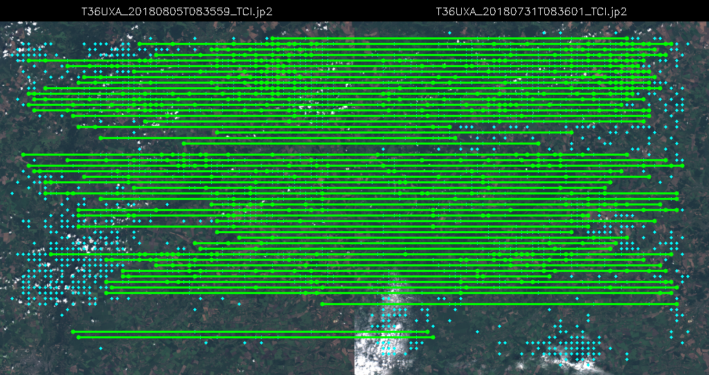
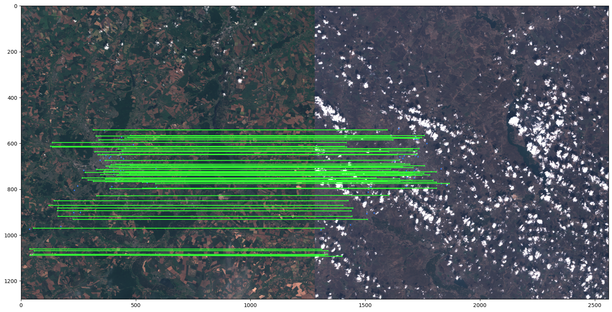
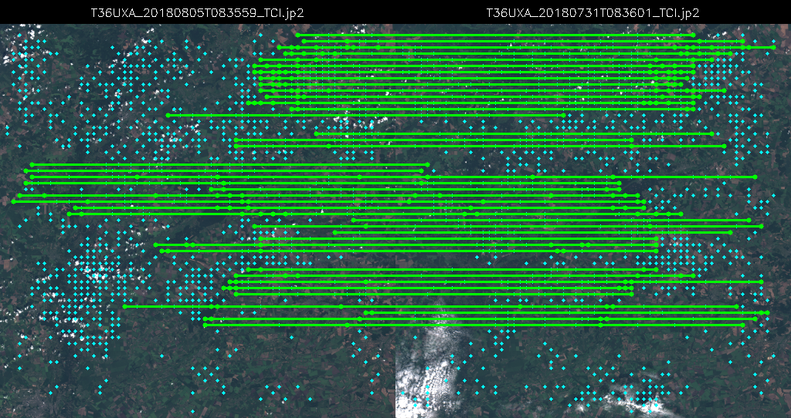

# Imatch - Image Matching for Satellite Imagery

An image matching system for satellite imagery

## Overview

This project provides an end-to-end pipeline for:
1. **Dataset Loading**: Loading and preprocessing satellite images with optional GeoJSON polygon annotations
2. **Baseline Models**: Pre-trained feature matching models (LoFTR and LightGlue)
3. **SuperPoint Training**: Training custom SuperPoint detectors using two approaches:
   - **Self-Matching**: Unsupervised training by matching augmented views of the same image
   - **Polygon Keypoints**: Supervised training using polygon vertex keypoints from GeoJSON annotations
4. **Inference**: Running feature extraction and matching on new image pairs

## Project Structure

```
Imatch/
├── dataset/
│   ├── dataset.py              # Basic image dataset loader
│   ├── polygon_dataset.py      # Dataset with GeoJSON polygon annotations
│   ├── utils.py                # Data augmentation utilities
│   └── data/                   # Dataset directory
│       ├── base_dataset/       # Base dataset with GeoJSON
│       ├── train/              # Training images
│       └── val/                # Validation images
├── models/
│   ├── baseline_models/
│   │   ├── loftr.py            # LoFTR baseline matcher
│   │   └── lightglue.py        # LightGlue baseline matcher
│   └── trainable/
│       └── superpoint/
│           ├── train_simple.py # SuperPoint self-matching training
│           ├── train_polygon.py # SuperPoint polygon keypoints training
│           └── inference.py    # SuperPoint + LightGlue inference
├── results/                    # Folder with image results
├── dataset.ipynb               # Dataset overview notebook
├── demo.ipynb                  # Training and inference demo
├── requirements.txt
└── README.md
```

## Installation

### Prerequisites

- Install LightGlue from [github repo](https://github.com/cvg/LightGlue)
- Base dataset is available on
[Drive](https://drive.google.com/drive/folders/1ruYrj2gWXzYWiFTspO-DU-DGd2NEgoT4?usp=sharing).
Downloaded folder must be placed to Imatch/dataset/data
- Trained model weights are available on
[Simple](https://drive.google.com/drive/folders/1ORfp7T2DtUEtfpS7OUCnOPBdWOhzxM7k?usp=sharing) and 
[Polygon](https://drive.google.com/drive/folders/1gliayJGYKo5X-L3fVAqEFBggJYVl2Sp6?usp=sharing).
Downloaded folder of the chosen model must be placed to Imatch/models/trainable/superpoint

### Setup

1. Go to project directory
```bash
cd Imatch
```

2. Install dependencies:
```bash
pip install -r requirements.txt
```

3. Ensure your dataset is organized:
   - Place satellite images (`.jp2` files) in `dataset/data/train/` and `dataset/data/val/`
   - For polygon training, place GeoJSON files in `dataset/data/base_dataset/`

## Quick Start

### Model Performance Comparison

Based on evaluation on satellite imagery:

**LoFTR** achieves the best performance for this task:
- Highest number of matches
- Robust to illumination changes and temporal variations

**LightGlue** shows good balance:
- Lesser number of matches ut still good performance
- Good performance for high-quality image pairs

**Custom SuperPoint algorithms**:
- Self-matching approach: Unsupervised training for self-matching with augmentations
- Polygon keypoint approach: Supervised training for specific feature detection
- Both approaches show promise but need further optimization

### 1. Run Baseline Model Inference

Match features using pre-trained baseline models for images from dataset or by path:

**LoFTR:**
```bash
#cd Imatch
python models/baseline_models/inference.py \
    --model loftr \
    --dataset_dir dataset/data/base_dataset \
    --image_idx0 3 \
    --image_idx1 5 \
    --output_path models/inference_res/loftr_matches.png
```

**LightGlue:**
```bash
#cd Imatch
python models/baseline_models/inference.py \
    --model lightglue \
    --dataset_dir dataset/data/base_dataset \
    --image_idx0 3 \
    --image_idx1 5 \
    --output_path models/inference_res/lightglue_matches.png
```

### 2. Train Self-Matching SuperPoint

Train SuperPoint using self-matching on augmented image views:

```bash
#cd Imatch
python models/trainable/superpoint/train_simple.py \
    --train_dir dataset/data/train \
    --val_dir dataset/data/val \
    --max_keypoints 512 \
    --learning_rate 1e-4 \
    --num_epochs 10 \
    --batch_size 4 \
    --save_dir models/trainable/superpoint/superpoint_sm_checkpoints
```

This will:
- Train SuperPoint by matching descriptors from augmented views
- Freeze specified in init_model backbone layers
- Save checkpoints to the specified directory
- Generate training history plots

### 3. Train Polygon Keypoint SuperPoint

Train SuperPoint using keypoints from polygon annotations:

```bash
#cd Imatch
python models/trainable/superpoint/train_polygon.py \
    --train_dir dataset/data/base_dataset \
    --val_dir dataset/data/val \
    --geojson_path dataset/data/base_dataset/deforestation_labels.geojson \
    --max_keypoints 512 \
    --learning_rate 1e-4 \
    --proximity_threshold 5.0 \
    --num_epochs 50 \
    --batch_size 4 \
    --save_dir models/trainable/superpoint/polygon_superpoint_checkpoints
```

This will:
- Load polygon vertices as ground truth keypoints
- Train SuperPoint to detect these keypoints
- Track recall, precision, and mean distance metrics

### 4. Run SuperPoint Inference

Match features between image pairs using trained SuperPoint:

```bash
#cd Imatch
python models/trainable/superpoint/inference.py \
    --dataset_dir dataset/data/base_dataset \
    --superpoint_weights models/trainable/superpoint/superpoint_sm_checkpoints/superpoint_final.pth \
    --image_idx1 3 \
    --image_idx2 5 \
    --max_keypoints 512 \
    --target_size 512 512 \
    --output_path matches.png \
    --show_keypoints
```

## Demo Notebooks

The project includes two interactive Jupyter notebooks that demonstrate the complete workflow:

### `dataset.ipynb` - Dataset Overview

This notebook demonstrates:
- Loading and visualizing satellite images
- Visualizing data augmentation transforms
- Working with polygon datasets and GeoJSON annotations

### `demo.ipynb` - Training and Inference Demo

This notebook provides a walkthrough of:
- Running baseline feature matching with LoFTR and LightGlue
- Training SuperPoint using self-matching approach
- Training SuperPoint using polygon keypoints
- Running inference with trained models
- Visualizing matches and comparing model performance

## Example Results

Sample output visualizations from the project:

| Baseline Models                                                                                | Custom SuperPoint                                                                                           |
|------------------------------------------------------------------------------------------------|-------------------------------------------------------------------------------------------------------------|
| **LoFTR**                                                                                      | **Self-Matching SuperPoint**                                                                                |
|          |       |
| **LightGlue**                                                                                  | **Polygon Keypoint SuperPoint**                                                                             |
|  |  |
