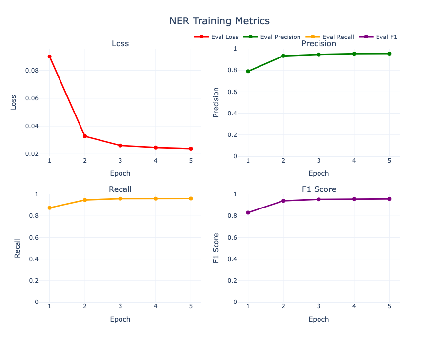

# NER - Named Entity Recognition for Mountain Entities

A NER system that identifies mountain entities in text using transformer models with a custom dataset generation pipeline powered by Mistral.

## Overview

This project provides an end-to-end pipeline for:
1. **Dataset Generation**: Creating synthetic NER datasets using Mistral models via Ollama
2. **Training**: Fine-tuning transformer models (default: DistilBERT) for NER tasks
3. **Inference**: Running predictions on new text data
4. **Evaluation**: Measuring model performance with precision, recall, and F1 scores

## Project Structure

```
NER/
├── src/
│   ├── dataset/
│   │   ├── generator/          # Text generation using LLMs
│   │   │   ├── base_ollama_generator.py
│   │   │   └── mistral/
│   │   ├── tagger/              # BIO tagging implementation
│   │   │   └── bio/
│   │   └── create_dataset.py    # Dataset creation pipeline
│   └── model/
│       ├── ner_train.py         # Model training
│       └── ner_inference.py     # Model inference
├── results/
│   ├── data/                    # Generated datasets
│   ├── inference/               # Inference results
│   └── ner-model/               # Trained model 
├── requirements.txt
└── README.md
```

## Installation

### Prerequisites

- Ollama installed with Mistral model

### Setup

1. Go to project directory
```bash
%cd NER
```

2. Install dependencies:
```bash
pip install -r requirements.txt
```

3. Ensure Ollama is running with Mistral model:
```bash
ollama pull mistral:7b
ollama serve
```

## Quick Start

### 1. Generate Dataset

Create a synthetic NER dataset using Mistral:

```bash
# %cd NER
python -m src.dataset.create_dataset --samples 10 --output results/data
```

This will:
- Generate 10 samples using Mistral
- Tag them with BIO format
- Save to CSV in `results/data/`

### 2. Train Model

Train the NER model on your dataset:

```bash
python src/model/ner_train.py --train_csv results/data/train_dataset.csv --test_csv results/data/test_dataset.csv --model_name distilbert-base-uncased --output_dir results/ner-model --epochs 5
```

Training will:
- Fine-tune the model on your dataset
- Validate on a held-out test set
- Save the best model based on F1 score
- Display training metrics plot

### 3. Run Inference

Make predictions on new text:

**Single text:**
```bash
python src/model/ner_inference.py --model_path results/ner-model --text "Mount Everest is the tallest mountain in the world."
```

**Batch CSV file:**
```bash
python src/model/ner_inference.py --model_path results/ner-model --csv_file results/data/inference_dataset.csv --text_column text --output_dir results/inference --filename inference_results.csv
```

## Demo Notebooks

The project includes two interactive Jupyter notebooks that demonstrate the complete workflow:

### `dataset_overview.ipynb` - Dataset Creation Pipeline

This notebook demonstrates:
- How the Mistral generator creates synthetic training data
- The BIO tagging process and format
- Complete dataset creation pipeline
- Dataset statistics and entity distribution analysis

### `demo.ipynb` - Training and Inference Demo

This notebook provides a walkthrough of:
- Training a BERT-based NER model on the dataset
- Visualizing training metrics and performance
- Running inference on single texts and batch datasets
- Analyzing prediction results and detection rates

## Model Performance

The model has been trained on the dataset and achieves strong performance on mountain entity recognition. 

### Training Metrics



### Evaluation Results

|     | Precision | Recall | F1-Score |
|-------------|--------|--------|----------|
| **Train**   | 0.9553 | 0.9617 | 0.9585   |
| **Test**    | 0.9509 | 0.9644 | 0.9576   |

